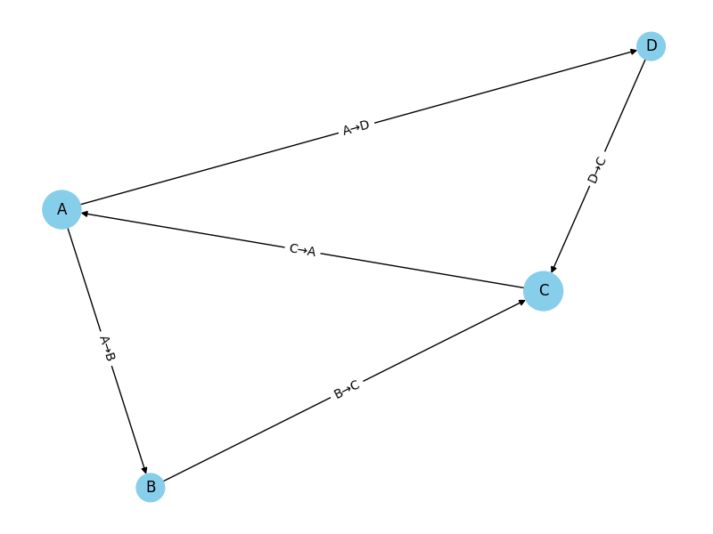

# PageRank Visualizer

This project computes and visualizes PageRank scores of nodes in a directed graph using Python’s NetworkX and Matplotlib libraries. It simulates how Google's original algorithm ranks webpages based on link structure.

---

## Description

This project implements Google’s PageRank algorithm to compute the relative importance of nodes in a directed graph. Each node represents a webpage (or entity), and edges represent links or relationships between them. The algorithm simulates a “random surfer” who navigates the network by following links, with a probability of randomly jumping to another page (damping factor = 0.85).

The resulting PageRank scores quantify the influence of each node based on both the **quantity** and **quality of incoming links**. Larger nodes in the visualization reflect higher PageRank values.

---

## Sample Output

PageRank Scores:
A: 0.3202
B: 0.1736
C: 0.3326
D: 0.1736

---

## Visualization

Below is a graph visualization with node sizes scaled by PageRank scores and directed edges labeled accordingly:



---

## Features

- Directed graph support
- PageRank computation with configurable damping factor
- Node sizes proportional to PageRank score
- Labeled edges for clarity
- Customizable layout using `spring_layout`

---

##  Technologies Used

- **Python 3.11**
- [NetworkX](https://networkx.org/) – for graph modeling and PageRank algorithm
- [Matplotlib](https://matplotlib.org/) – for visualizing node rankings

---

##  Installation

1. Clone the repository:
   ```bash
   git clone https://github.com/ikocasi/pagerank-visualizer.git
   cd pagerank-visualizer
